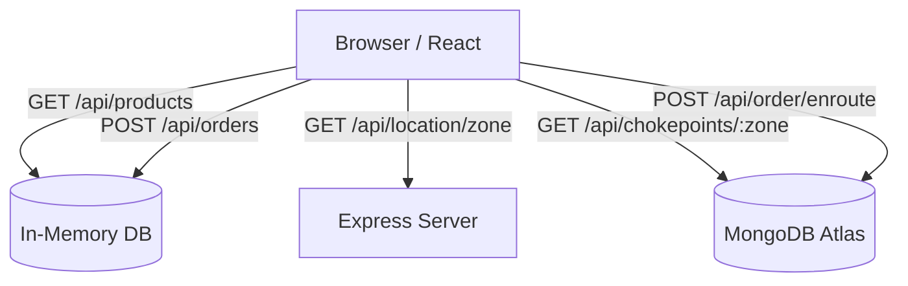

# 📦 EnRoute Delivery System - Smart Last-Mile Optimization


## 📖 Overview

**EnRoute Delivery** is an innovative delivery model and full-stack web application designed to optimize last-mile logistics. Instead of traditional doorstep delivery, EnRoute allows customers to pick up their orders from "chokepoints" along their daily commuting routes. 

This approach significantly reduces delivery miles, fuel consumption, and carbon emissions while improving delivery efficiency and scalability for retailers. The project integrates a modern e-commerce shopping experience with an interactive, geo-aware delivery map.

---

## ✨ Features

- **🛍️ E-Commerce Storefront:** A fully functional product catalog, cart management, and checkout process.
- **📍 Smart Location Input:** Manual address entry or automatic geolocation to map users to predefined delivery zones.
- **🗺️ Chokepoint Selection:** An interactive map (powered by Leaflet) displaying nearby pickup points with color-coded traffic congestion indicators.
- **⏱️ Slot Assignment & Load Balancing:** Backend logic to assign pickup time slots while balancing crowd loads across different chokepoints.
- **🎨 Modern UI/UX:** Glassmorphism design patterns, responsive layouts, and smooth animations using Tailwind CSS and Radix UI.

---

## 🚀 Technical Stack

### Frontend
- **Framework:** React 18, Vite
- **Routing:** Wouter
- **Mapping:** React-Leaflet / Leaflet.js
- **State Management:** TanStack Query, React Context
- **Styling:** Tailwind CSS, Radix UI Primitives, Framer Motion

### Backend
- **Server:** Node.js, Express 4
- **Database:** MongoDB (Enroute Orders & Chokepoints) & In-Memory Store (Products)
- **Schema & Validation:** Drizzle ORM, Zod
- **Geolocation Math:** Geolib

---

## 🚦 Getting Started

### Prerequisites

- [Node.js](https://nodejs.org/) (v16+ recommended)
- [MongoDB](https://www.mongodb.com/) account or local instance

### Installation

1. **Clone the repository:**
   ```bash
   git clone https://github.com/amoltrip28/Enroute_Delivery_System.git
   cd Enroute_Delivery_System
   ```

2. **Install dependencies:**
   ```bash
   npm install
   ```

3. **Environment Setup:**
   Create a `.env` file in the root directory and add your MongoDB URI:
   ```env
   MONGO_URI=mongodb+srv://<username>:<password>@cluster.mongodb.net/enroute?retryWrites=true&w=majority
   ```

4. **Run the Development Server:**
   ```bash
   npm run dev
   ```
   The application will be running at `http://localhost:5000`.

---

## 💡 How It Works

1. **Shop & Checkout:** The customer browses products and proceeds to checkout.
2. **Location Mapping:** The user enters their location, and the system assigns them to a delivery zone.
3. **Chokepoint Discovery:** The interactive map displays optimal pickup points (chokepoints) in the zone with real-time traffic scores.
4. **Slot Selection:** The customer selects a preferred chokepoint and time slot.
5. **Smart Assignment:** The backend checks capacity and load balances before confirming the slot.
6. **Confirmation:** The final chokepoint and pickup window are provided in the order confirmation.

---

## 🌍 Impact (South Dallas Case Study)

Analyzing a use case with ~500,000 households and ~100,000 online orders/week:

- **Current Avg. Delivery Distance:** 5 miles
- **Fuel Consumption:** 0.15 gallons/mile

**Key Savings with 10% EnRoute Adoption:**
- **Miles Saved:** ~50,000 miles/week
- **Fuel Saved:** ~7,500 gallons/week
- **Cost Savings:** ~15% reduction in last-mile delivery cost
- **Emissions Reduction:** ~67 metric tons CO₂/week

---

## 🏗 System Architecture

The project consists of a monorepo containing a React frontend and an Express backend, sharing TypeScript schemas.



---

## 🔮 Future Enhancements

- **Dynamic Route Optimization:** Live optimization for delivery vans stocking the chokepoints.
- **ML-Based Demand Prediction:** Forecasting chokepoint capacity and congestion using historical data.
- **Incentive Systems:** Gamification and rewards for customers who choose EnRoute delivery.
- **Persistent Data:** Migrating product and traditional order storage from memory to a fully scalable database (PostgreSQL/MongoDB).

---

*Built with ❤️ to optimize the future of delivery logistics.*
